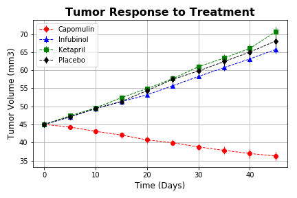
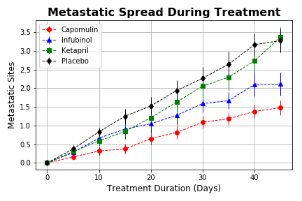
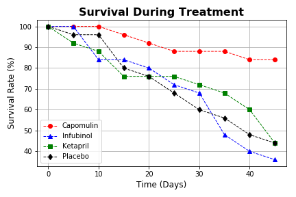
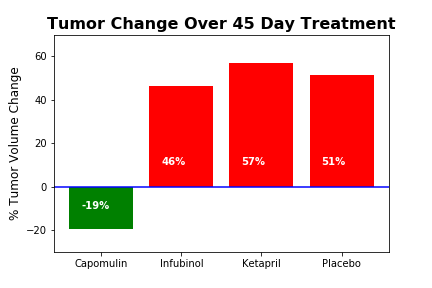

# The Power of Plots

## Background

In this study for potential treatments to squamous cell carcinoma (SCC), 250 mice were treated through a variety of drug regimes over the course of 45 days. Their physiological responses were then monitored over the course of that time. Using this sample data we are going to compare four treatments (Capomulin, Infubinol, Ketapril, and Placebo) using plots.

## Plots

### Tumor volume change over time for each treatment.

### Number of metastatic (cancer spreading) sites changes over time for each treatment.

### Number of mice still alive through the course of treatment (Survival Rate)

### Comparison the total % tumor volume change for each drug across the full 45 days.

